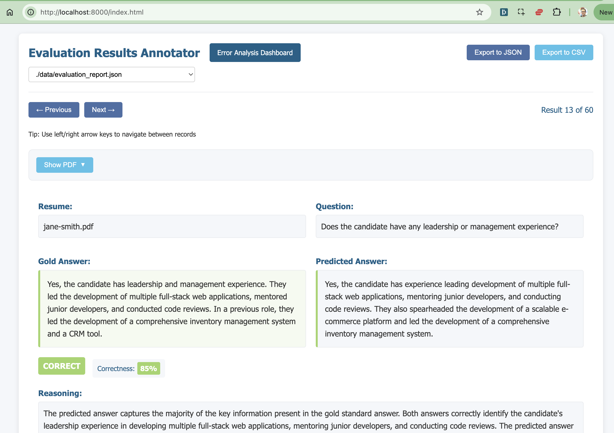
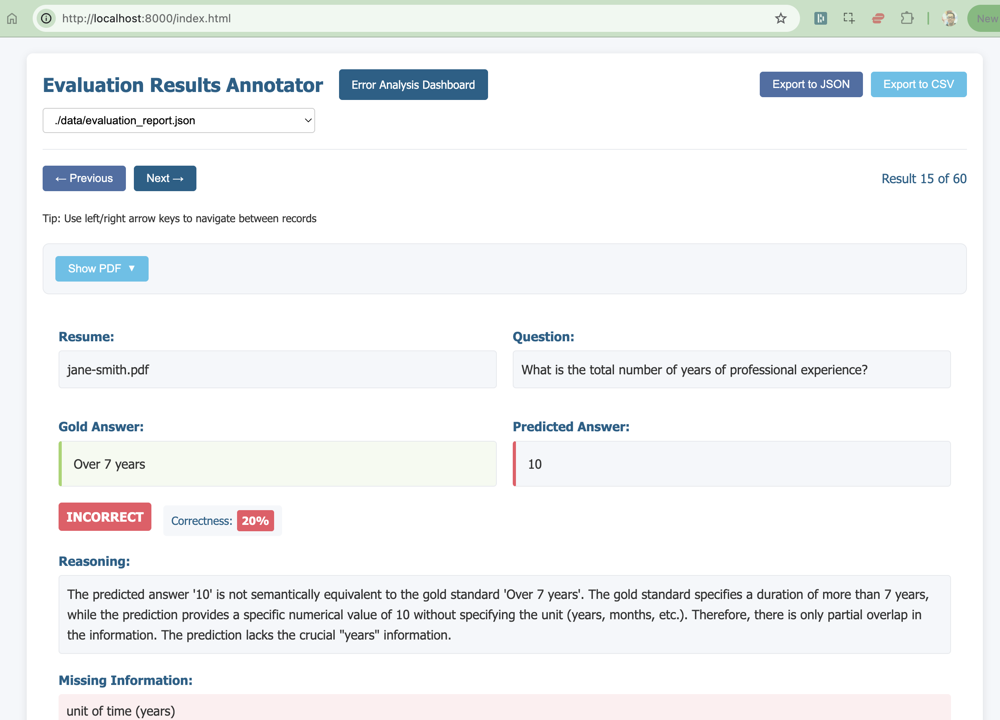
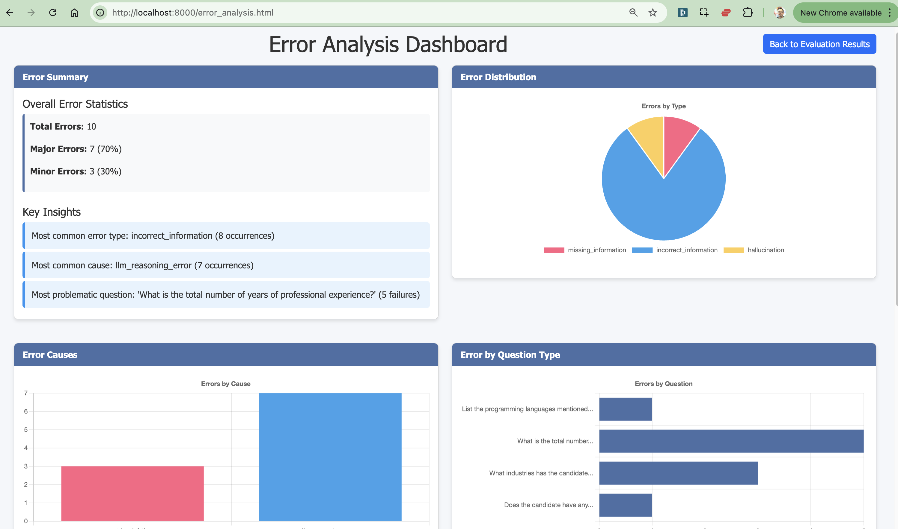
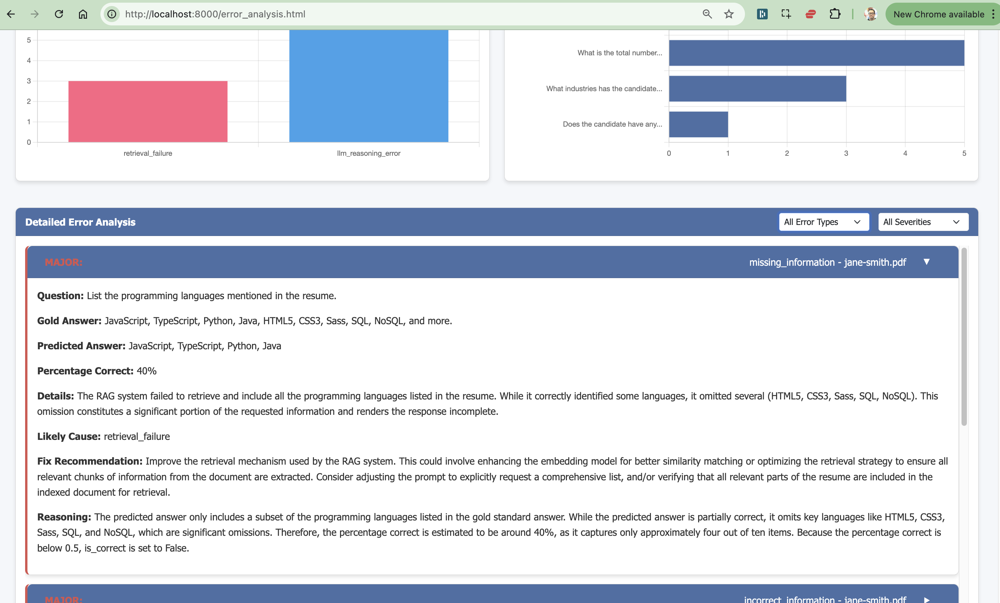

## LLM Zero to Hero  

These are my workshop notes and exercises for the course I'm currently taking - [Building LLM Applications for Data Scientists and Software Engineers](https://maven.com/hugo-stefan/building-llm-apps-ds-and-swe-from-first-principles). Build LLM-powered software reliably & from first principles. Learn the GenAI software development lifecycle: agents, evals, iteration & more.

[Demo Day Slides here](./demo-day-slides/README.md)

---

## **Working Locally**

### **1. Clone the Repository**
```bash
git clone https://github.com/jaeyow/llm-zero-to-hero.git
```

### **2. Set Up Python Environment**
```bash
pyenv install 3.12.8
pyenv local 3.12.8
python -m venv .venv
source .venv/bin/activate
```

### **3. Install Dependencies**
```bash
pip install -r requirements_llama_index.txt  # LlamaIndex RAG
pip install -r requirements_vanilla.txt     # Vanilla RAG
```

---

## **Workshop 1**

### **A) RAG with LlamaIndex**
Run the following command:
```bash
python 01-rag-llamaindex.py
```

#### **My Notes**
- **VectorStoreIndex**: Creates an in-memory vector store using **LlamaIndex's** default embedding model (defaults to **OpenAI's embedding model**).
- **Query Engine**: Converts user queries into embedding vectors, retrieves similar chunks, and synthesises responses using **OpenAI's LLM**.
- **Default Behavior**: LlamaIndex uses default embedding models, LLMs, and prompts unless explicitly overridden.
- **Experiment**: Unset the OpenAI API key to observe app behavior—it prompts for the key since it relies on OpenAI for embeddings and synthesis.
- **Interaction**: Uses a simple **Gradio wrapper** for user interaction.
- **Prompt Analysis**: `query_engine.get_prompts()` reveals multiple prompts, making it unclear which one is used.

#### **Issues with LlamaIndex**
- Defaults to OpenAI models without transparency.
- Unclear prompts sent to the LLM.
- Difficult to understand internal workings, making improvements challenging.

**Summary**: LlamaIndex simplifies RAG creation but introduces too much abstraction, obscuring the process.

---

### **B) Vanilla RAG**
Run the following command:
```bash
python 02-rag-vanilla.py
```

#### **Homework**
Remove abstractions introduced by libraries like LlamaIndex to fully understand the RAG process.

#### **Steps**
1. **Manual RAG Implementation**:
    - Use the OpenAI API directly.
    - Generate embeddings for user queries and documents.
    - Write custom prompt instructions for the LLM.
    - Use the OpenAI LLM for synthesis.

2. **Log Prompts and Queries in SQLite**:
    - Store user queries, prompts, chunk sizes, and LLM responses in a SQLite database.

3. **Experiment with Prompts**:
    - Analyse how different prompts affect LLM results.

#### **My Notes**
- Removing LlamaIndex provides full control over the RAG process and prompts.
- Explicitly use the **OpenAI embedding model** and **OpenAI LLM**.
- Log additional details (e.g., queries, prompts, chunk sizes) in SQLite for better analysis.
- Enables experimentation and iteration on prompts for improved results.

---

## **Deploying to Modal**

### **A) LlamaIndex RAG**
See [Llama Index RAG in Modal](./workshop_1/modal/modal_rag_llamaindex/README.md).

### **B) Vanilla RAG**
See [Vanilla RAG in Modal](./workshop_1/modal/modal_rag_vanilla/README.md).

---

## **Workshop 2**

Workshop 2 focuses on **LLM APIs and Prompt Engineering**, exploring parameters like **Temperature** and **Top-p (nucleus sampling)** and their impact on LLM results. It also involves iterating on the application from Workshop 1 by removing LlamaIndex and using the OpenAI API directly, providing full control over prompts and RAG orchestration.

---

## **Workshop 3,4,5,6**

Workshop 3 to 6 introduces **evaluations** for the application, now free from LlamaIndex. The goal is to perform error analysis and improve the system.

### **Synthetic Data for Evaluation**

#### **Exercise**
0. **RAG Demo App** 
We still have our Gradio Resume Q&A app, and how we can run it:
```bash
cd workshop_4_5_6
python rag_demo_vanilla.py
```
The app is running at [http://localhost:7860](http://localhost:7860). You can ask questions about the resume, and it will use the RAG pipeline to answer them.

To start running our evaluation workflows, follows steps 1 to 5 below:

1. **Create a Gold Set**:
    - Use `data/questions.json` as the list of questions for this exercise.
    - Run [01_generate_gold_set.py](./workshop_3/01_generate_gold_set.py) to create `data/gold_set.jsonl`. This script asks the LLM to generate answers to the questions in `data/questions.json`.
    - Review and curate the answers for accuracy.

2. **Generate Predictions**:
    - Use the `rag_pipeline` function from Workshop 1 to generate predictions.
    - Run [02_run_predictions.py](./workshop_3/02_run_predictions.py) to create `data/predictions.jsonl`.

3. **Evaluate Predictions**:
    - Merge predictions and the gold set, and use [Instructor](https://python.useinstructor.com/) for structured evaluation.
    - Run [03_run_evals.py](./workshop_3/03_run_evals.py) to compare predictions against the Gold Set.
    - Generate `data/evaluation_report.json`.
    - Use metrics from SKLearn to calculate accuracy, precision, recall, and F1 score.
    - run [04_error_metrics.py](./workshop_3/04_error_metrics.py) to generate the evaluation report.

4. **Review and Annotate**:
    - Review the evaluation report and annotate the results.
    - Note that in the real world, this is the time to hand this annotation tool to the **domain expert** to review the results and add critiques. It is important to add critiques for both the correct and incorrect answers.
    - This will help you understand the model's performance and identify areas for improvement. And this is strategic because these critiques are what will be used to iterate on the prompts, **eg. to add few-shot examples to the prompt** to cater for this specific failure mode.
    - An annotation app is available that allows you to review the evaluation report and annotate the results. 
    - This allows you to go through the evaluation report and annotate the results. Take special care in adding some critique, for both the correct and incorrect answers. This will help you understand the model's performance and identify areas for improvement. Here: [http://localhost:8000](http://localhost:8000)
    - Also, this will help us with the [critique shadowing method](https://hamel.dev/blog/posts/llm-judge/#step-3-direct-the-domain-expert-to-make-passfail-judgments-with-critiques) as explained by Hamel, to help improve the model's performance when we start iterating on the prompts.
    - This will also return the error analysis report for more detailed analysis.
    ```bash
    cd data_viewers
    python serve.py
    ```








5. **Cost and Latency Evaluation (to be completed...)**:
    - Note: the switch to Gemini from OpenAI broke the token counting since Gemini does not return the token count in the same way as OpenAI.
    - Finally , run [05_cost_latency_analysis.py](./workshop_3/05_cost_latency_analysis.py) to run the script to evaluate cost and latency.
    - Track token usage for cost analysis:
        - Input tokens (prompt + context)
        - Output tokens (generated response)
        - Total tokens used per query
    - Measure latency metrics:
        - Retrieval time
        - LLM inference time
        - Total request-to-response time
    - Generate cost efficiency metrics:
        - Cost per correct answer
        - Token efficiency (accuracy per 1K tokens)

#### **Eval Metrics Output**
- Evaluation Report [evaluation_report.json](./workshop_3/data/evaluation_report.json)
- Error Analysis Report [error_analysis.json](./workshop_3/data/error_analysis.json)

#### Summary and Next Steps
### **Summary and Next Steps**

#### **Summary**
The evaluation process provided insights into the model's performance:
- **Evaluation Report**: Highlighted areas where the model performed well and where it struggled, offering a clear view of accuracy, precision, recall, and F1 scores.
- **Error Analysis Report**: Identified common failure patterns, such as incorrect retrievals, ambiguous prompts, or synthesis errors.
- **Annotation Insights**: Critiques from the annotation process revealed specific weaknesses in the model's reasoning and response generation.

#### **Next Steps**
1. **Prompt Iteration**:
    - Refine prompts based on error patterns and critiques.
    - Experiment with alternative phrasing to improve clarity and specificity.

**My Notes on prompt iteration**
In [evaluation_report.json](./workshop_4_5_6/data/evaluation_report.json) before we started improving and iterating on our RAG application, we captured the baseline metrics, and for this exercise, we use **F1**, which is defined as the harmonic mean of precision and recall. It is a measure of a model's accuracy that considers both false positives and false negatives.

Baseline F1 Score: **86.79%**

**Iteration #1:**
Went back and revisited the System Prompt, and realised that it was not clear enough, so I updated to just add a bit of clarity.

Original System Prompt:

> You are a helpful assistant. Only answer questions based on the context provided. Be concise, factual, and avoid speculation.

New System Prompt:
> You are a helpful and expert resume reviewer. You can remember all the details of a presented resume and answer any questions about it. Do not hallucinate and ensure your answers are backed by factual responses based on the resume provided.

New F1 Score: **90.91%**

**Iteration #2:**
This application processes resumes which are typically only a few pages long and usually about 1000 words or so. With this in mind, I decided to try not chunking at all, and just passing the entire document to the LLM. This will surely be within the context window of the LLM, and this should help improve the app's metrics.

New F1 Score: **92.86%**

**Iteration #3:**
After inspecting the error analysis report, I noticed that for John Doe's resume, the question ""What is the total number of years of professional experience?" was always wrong. The Gold Set says 2.5 years, however, our RAG says 1.5 years. 

Reviewing the resume, John Doe actually has 1.5 years of professional experience, so I simply updated the Gold Set to reflect this.

Another failure mode is that the RAG system often misses the qualifiers in the answer, for example, if the answer is "over 3 years", it only says "3 years". To address this, I added a few-shot example to the system prompt to help the LLM understand that it should include qualifiers in its answers.

Added examples to the prompt:
> - Question: What is the total number of years of professional experience?
    Context: The candidate has over 3 years of experience in software development.
    Answer: Over 3 years.

New F1 Score: **94.74%**

Prompt Iteration Summary:
- **Iteration #1**: Improved system prompt clarity.
- **Iteration #2**: Removed chunking to pass the entire document to the LLM.
- **Iteration #3**: Updated Gold Set to reflect accurate professional experience. Also, added few-shot examples to the system prompt to include qualifiers in answers.

Because we had our evals set up, we were able to quickly iterate on the prompts and see the results. This is a great example of how to use evals to improve your LLM applications.

**Just these quick iterations improved the F1 score from 86.79% to 94.74%!**

We can continue to iterate on the prompts and improve the system, but this is a great start.

2. **Model Fine-Tuning**:
    - Use annotated data to fine-tune the model or adjust hyperparameters for better performance.

3. **Pipeline Optimization**:
    - Address latency issues by optimizing retrieval and LLM inference steps.
    - Explore caching mechanisms for frequently queried data.

4. **Cost Efficiency**:
    - Investigate token usage patterns to reduce costs without sacrificing accuracy.
    - Compare OpenAI and Gemini models for cost-performance trade-offs.

5. **Re-Evaluation**:
    - Re-run the evaluation pipeline after implementing changes to measure improvements.
    - Focus on metrics like F1 score and cost per correct answer to track progress.

6. **Documentation and Reporting**:
    - Document findings and improvements for future reference.
    - Share updated evaluation reports and error analyses with stakeholders.

By iterating on these steps, the system can achieve better accuracy, efficiency, and reliability in real-world applications.

